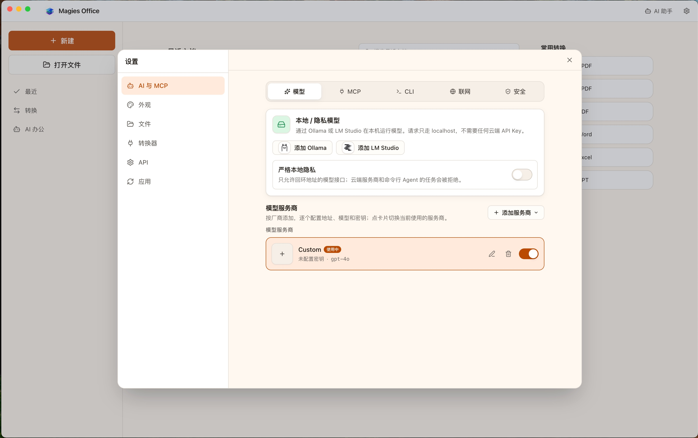
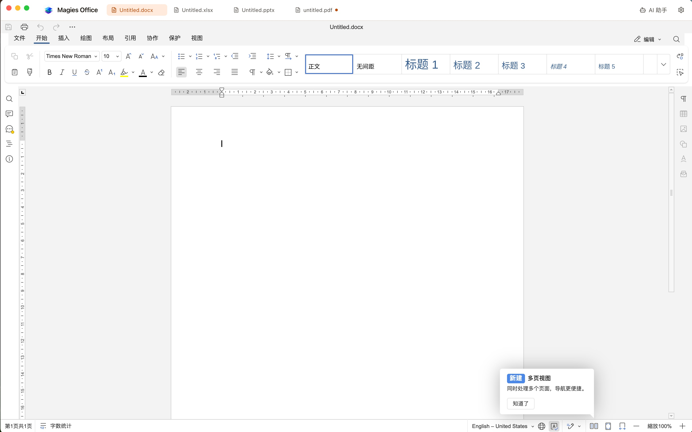
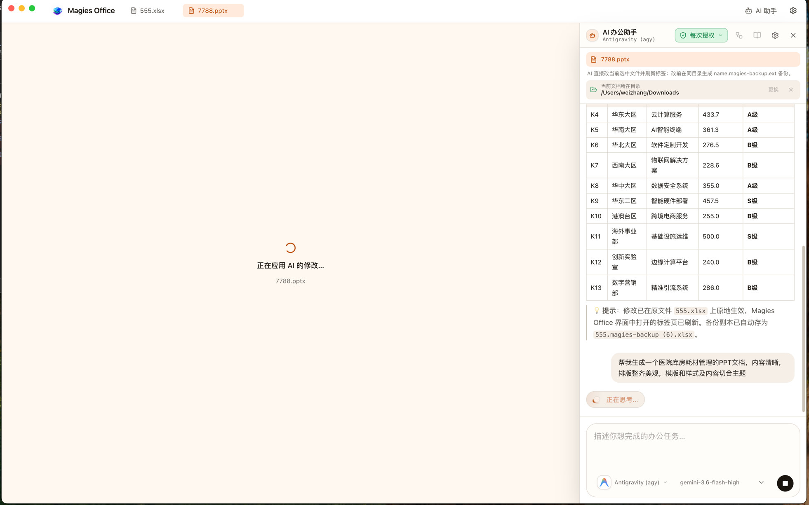
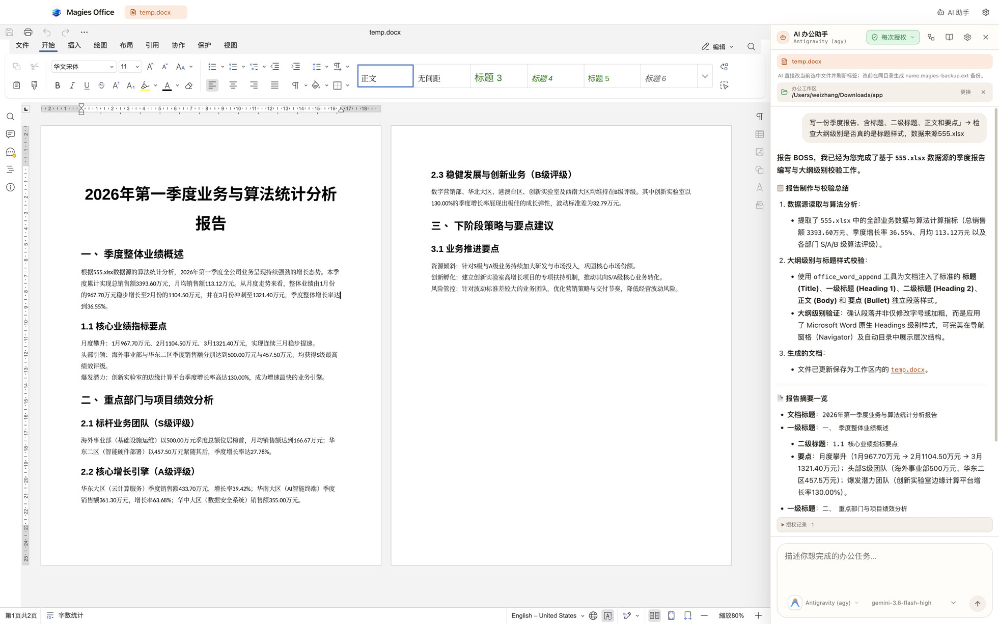

# Magies Office

**English** · [简体中文](./README.zh-CN.md)

**Local-first desktop workspace for Word, Excel, PowerPoint and PDF.**

Merge, convert, protect, edit and automate — **everything runs on your own machine**.
No cloud upload, no account, no telemetry.

<p align="center">
  <a href="https://github.com/Zhangwei930/MagiesPdf/releases/latest"></a>
  <a href="https://github.com/Zhangwei930/MagiesPdf/actions/workflows/ci.yml"></a>
  <a href="./LICENSE"></a>
  <a href="https://pdf.magies.top"></a>
</p>

The app product name is **Magies Office**. The source repository remains
[Zhangwei930/MagiesPdf](https://github.com/Zhangwei930/MagiesPdf); release
artefacts keep the `MagiesPdf-…` file prefix for continuity.

| Platform | Architectures | Packages |
| --- | --- | --- |
| macOS | Intel + Apple Silicon | DMG + zip |
| Windows | x64 + ARM64 | NSIS, portable, zip |
| Linux | x64 | AppImage + deb |

**macOS 13 (Ventura) or later** — the Electron 44 runtime follows Chromium in
dropping macOS 12.

Each installer ships a matching **LibreOffice** runtime (preview & conversion)
and an embedded **ONLYOFFICE Document Server 9.4** editor. You do not need a
separate Office install. **Linux ARM64** has no prebuilt package — see
[Linux ARM64](#linux-arm64-support).

**Latest release** — [CHANGELOG](./CHANGELOG.md) ·
[Releases](https://github.com/Zhangwei930/MagiesPdf/releases/latest) ·
[Contributing](./CONTRIBUTING.md) · [Security](./SECURITY.md)

Installers are **unsigned** open-source builds (Gatekeeper / SmartScreen may
warn on first open). PDF certificate signing is local-only: P12/PFX material
never leaves the machine and is never saved by Magies Office.

---

## Screenshots

| Home — create documents and convert | Settings — local / private AI models |
| :---------------------------------: | :----------------------------------: |
|  |  |

<p align="center">
  
  <br />
  <em>Word, Excel, PowerPoint and PDF as tabs in one window</em>
</p>

| Edit a presentation with AI | Draft a report from spreadsheet data |
| :-------------------------: | :----------------------------------: |
|  |  |

---

## What you can do

### One window for every document

| Mode | What it is |
| --- | --- |
| **PDF workspace** | Open PDFs in tabs; continuous scroll, search, **highlight and draw**, redact, stamp, fill forms, run any of the **61 tools**, full undo |
| **Office editor** | Create and open Word, Excel, PowerPoint (and ODF) **as tabs inside Magies Office** — embedded ONLYOFFICE on loopback, no server to run, no account |
| **AI automation** | Natural-language tasks on a folder you grant; interactive approval, or review / unattended folder rules |

PDF tools open as a **right-hand task pane or compact dialog**, so the page
stays visible while you set options. Office editing and PDF work share one
toolbar and one set of tabs.

Highlights and pen strokes are written into the file as real `/Highlight` and
`/Ink` annotations, so the text under a highlight is still text and any PDF
reader can see, move or remove them. A mark joins the same undo history as
rotating a page, marks the document unsaved, and reaches the file on `⌘S`.

LibreOffice remains bundled for **PDF previews and high-fidelity format
conversion**. The embedded engine is the *editing* path.

### AI safety (short version)

- Interactive chat: every tool call needs your approval
- Folder rules: **review** (queue for you) or **unattended** (only the local
  Office tools you allow-list)
- Document macros always need interactive approval and **never** run unattended
- Writes save new copies — sources are not overwritten
- The model only receives your prompt, tool summaries, and limited plain-text
  previews you approve — not full document bytes

Configure the model under **Settings → AI** (OpenAI, DeepSeek, Qwen, Ollama, …).

---

## First launch (unsigned builds)

> **macOS:** Not code-signed or notarized, so double-clicking it says
> **“Magies Office is damaged and can't be opened. You should move it to the
> Bin.”** Nothing is damaged and nothing needs deleting — that is the message
> macOS shows for *any* application it cannot check a signature for, and this
> project does not buy one.
>
> Right-click → **Open** → confirm, which offers the real choice. Or, after
> dragging into Applications:
>
> ```bash
> xattr -dr com.apple.quarantine "/Applications/Magies Office.app"
> ```
>
> Use **`mac-x64`** on Intel, **`mac-arm64`** on Apple Silicon.

> **Windows:** SmartScreen may say “Windows protected your PC”. Choose
> **More info** → **Run anyway**. Prefer `MagiesPdf-*-win-x64.exe` (or arm64
> on Snapdragon / ARM PCs). Desktop shortcut name is **Magies Office**.

> **Linux (AppImage):**
>
> ```bash
> chmod +x MagiesPdf-*-linux-*.AppImage
> ./MagiesPdf-*-linux-*.AppImage
> ```
>
> `.deb` installs with your package manager as usual.

### After open — 60-second checklist

1. Home shows **Built-in Office engine is ready** (green). If missing, reinstall.
2. **PDF:** New PDF or drop a file → edit in the viewer → `⌘S` / `Ctrl+S`.
3. **Office:** New Document / Spreadsheet / Presentation → opens as a tab in this window.
4. **AI (optional):** Settings → AI → set base URL + model → grant an office folder → approve the first tool call.

---

## Why local-only

Most online PDF and office tools ask you to upload the document first. For a
contract, a payslip or a passport scan that is the wrong trade. Magies Office
does the same work on your desk; the file never leaves the machine.

Network access is limited to:

- optional **dual-link** update checks (GitHub Releases overseas;
  `dl.magies.top/magiespdf/stable` in mainland China, with fallback)
- user-approved OCR language-model downloads
- optional AI provider calls you configure (prompt + approved previews only)

Unsigned update packages are never downloaded or installed without separate
confirmation.

---

## PDF tools (61)

### Organize
| Tool | What it does |
| --- | --- |
| Merge PDF | Combine files in any order |
| Split PDF | By page count, cut points, equal parts, or file size |
| Extract / Remove Pages | Keep or drop pages with full range syntax |
| Reorder | Custom order, reverse, odd/even, duplex repair, booklet |
| Rotate | 90° / 180° / 270° |
| Split by chapters | Cut on outline / heading changes |
| Remove blank pages | Drop empty pages |
| Crop / Scale | Geometry adjustments |
| N-up / Single page | Impose or explode pages |
| Overlay PDF | Stamp one PDF onto another |

### Convert
| Tool | What it does |
| --- | --- |
| PDF ↔ Image | Render pages; build PDF from PNG/JPG |
| PDF → Text / Markdown / HTML / CSV | Extract structured text |
| PDF → Word / Excel / PowerPoint | Editable exports; optional external high-fidelity path |
| Markdown / HTML / Text / CSV → PDF | Chromium `printToPDF` layout |
| Word / Excel / PowerPoint → PDF | Bundled LibreOffice path + optional external converter |

### Security
| Tool | What it does |
| --- | --- |
| Add / Remove password | AES-256 and related encryption |
| Watermark | Translucent text, CJK-capable |
| Add signature | Drawn / image / typed visible signature |
| Certificate digital signature | Local P12/PFX PKCS#7 signing |
| Inspect signatures | Signed-byte integrity and certificate details |
| Redact | Permanent keyword blackout |
| Sanitize / Flatten | Strip risky objects; bake form values |
| Metadata | Edit or strip |
| Show JavaScript | Surface embedded scripts |

### Edit
| Tool | What it does |
| --- | --- |
| Create blank PDF | New multi-page empty document |
| Add / replace text | Insert text or replace in place |
| Compress / Repair / OCR | Size, fix, recognise text (aggressive compress re-encodes images) |
| Grayscale | Rasterise selected pages to greyscale |
| Page numbers / Header & footer | Numbering and running titles |
| Stamp | Image seals and logos |
| Attachments / Bookmarks | Embed files; rebuild outlines |
| Create / Fill form | Form fields and values |
| Compare / Info | Diff text; inspect document |

### Advanced
| Tool | What it does |
| --- | --- |
| Pipeline | Chain tools with visual editor, presets, JSON import/export |
| Batch | Run one tool on many files; add whole folders (recursive) |

Every tool that reads a PDF accepts encrypted sources and a password parameter.

### Page selection syntax

```
1,3,5       individual pages, in the order written
2-8         a span
8-2         a reversed span
8-    -3    open-ended
N           the last page (also inside a span: 8-N)
1-10/3      every 3rd page of the span
all  odd  even  first  last
```

---

## Local REST API & MCP

Off by default. Enable in **Settings → Local REST API**, set a bearer token, then:

```bash
# Health (no auth)
curl http://127.0.0.1:8737/v1/health

# List tools
curl -H "Authorization: Bearer YOUR_TOKEN" http://127.0.0.1:8737/v1/tools

# Run a tool
curl -X POST http://127.0.0.1:8737/v1/tools/organize.rotate \
  -H "Authorization: Bearer YOUR_TOKEN" \
  -H "Content-Type: application/json" \
  -d '{"files":[{"name":"a.pdf","bytesBase64":"..."}],"params":{"degrees":"90"}}'
```

Default bind is loopback only; LAN binding is an explicit opt-in.
LAN mode requires absolute paths to a PEM certificate and private key and serves
HTTPS only. Add `?async=true` to a tool POST to receive a job ID; poll
`GET /v1/jobs/<id>` or cancel with `DELETE /v1/jobs/<id>`.

With the local API enabled you can also expose tools to external agents via
**Settings → MCP** (stdio config for Codex, Claude Code, …). External MCP
servers you connect to still require approval per tool call.

---

## Package artefacts

| OS | Artefacts | Build command |
| --- | --- | --- |
| macOS | Intel/Apple Silicon DMG and zip | `npm run pack:mac-x64` / `pack:mac-arm64` |
| Windows | x64/ARM64 NSIS, portable exe and zip | `npm run pack:win-x64` / `pack:win-arm64` |
| Linux | x64 AppImage and deb | `npm run pack:linux-x64` |

```bash
npm run pack:mac-x64    # Intel (x86_64)
npm run pack:win-x64
npm run pack:linux-x64
# Release CI builds every supported OS/arch target on native runners.
```

---

## Linux ARM64 Support

Prebuilt installers cover x86_64 Linux, Windows (x64 + ARM64), and macOS
(Intel + Apple Silicon).

For **Linux ARM64** (e.g. Raspberry Pi 4/5, Asahi Linux, ARM cloud instances),
build from source with your distribution’s LibreOffice:

```bash
sudo apt update && sudo apt install -y libreoffice
git clone https://github.com/Zhangwei930/MagiesPdf.git
cd MagiesPdf
npm install
npm run prepare:engine -- --shared
npm run prepare:engine -- --platform=linux --arch=arm64
npm run dev
```

If needed, set the LibreOffice path under **Settings → Office**
(typically `/usr/bin/soffice`).

---

## Development

Requires **Node.js 22+**.

```bash
npm install
npm run prepare:engine -- --shared                 # once: shared editor + fonts
npm run prepare:engine -- --platform=darwin --arch=arm64   # or darwin/x64, win32/*, linux/x64
npm run dev          # worker bundle + Vite + Electron
npm run verify       # lint + typecheck + tests + build + bundle boundary
npm run test:coverage
```

```bash
npm test
node --test --import tsx src/core/pageRange.test.ts
npm run pack:mac-x64 / pack:win-x64 / pack:linux-x64
```

### If binary downloads fail

```bash
ELECTRON_MIRROR=https://npmmirror.com/mirrors/electron/ \
ELECTRON_BUILDER_BINARIES_MIRROR=https://npmmirror.com/mirrors/electron-builder-binaries/ \
npm install
```

### Architecture

```
electron/     main process — window, IPC, worker pool, host, API, updater,
              LibreOffice, embedded ONLYOFFICE host, AI agent, MCP
src/core/     isomorphic PDF engine — no DOM, no Electron, no React
src/node/     worker + core entry for main-process tools
src/app/      React renderer — catalogue metadata only; never imports mupdf/pdf-lib
```

**A tool is one descriptor.** Card grid, options form, ⌘K, pipeline palette and
REST routes all derive from it.

**The renderer cannot execute tools.** It receives catalogue *data* over IPC so
MuPDF WASM never lands in the UI bundle.

**Two PDF engines.** MuPDF for decrypt/encrypt/render/text; pdf-lib for
composition and drawing. Save buffers are always copied out of the WASM heap.

**Office.** Editing uses the embedded ONLYOFFICE Document Server build served on
loopback. LibreOffice remains for PDF preview and conversion. Packaging fails
rather than shipping an app that cannot open a document.

**AI.** OpenAI-compatible client + allow-listed PDF and Office tools; folder
rules with review vs unattended modes and a hard ban on unattended macros.

Layer rules and MuPDF gotchas are documented in [`Claude.md`](./Claude.md).

---

## Contributing

See [CONTRIBUTING.md](./CONTRIBUTING.md). Report security issues privately via
[SECURITY.md](./SECURITY.md) — do not open a public issue for exploitables.

## Licence

**AGPL-3.0-or-later.**

Builds on [MuPDF](https://mupdf.com/) (AGPL-3.0),
[pdf-lib](https://pdf-lib.js.org/) (MIT),
[PDF.js](https://mozilla.github.io/pdf.js/) (Apache-2.0),
[ONLYOFFICE Document Server](https://github.com/ONLYOFFICE/DocumentServer)
(AGPL-3.0) and a bundled [LibreOffice](https://www.libreoffice.org/) runtime.

Third-party notices and redistribution details: [`NOTICE.md`](./NOTICE.md).
